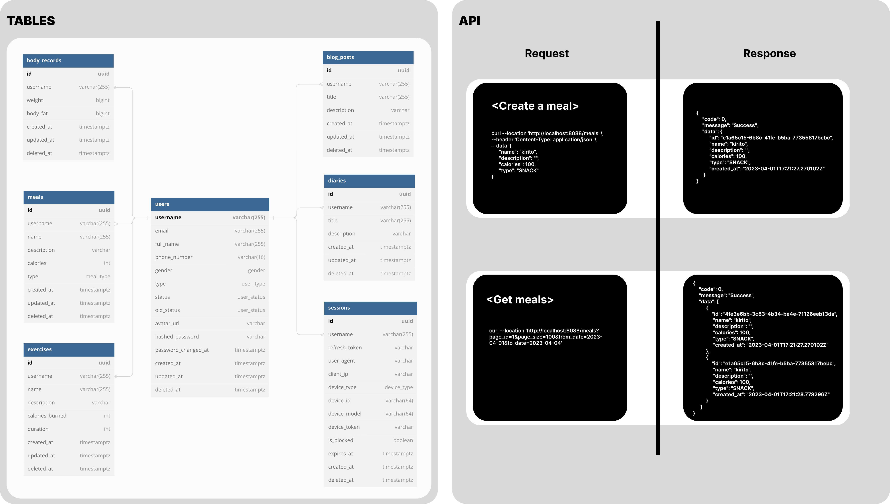

# Go Healthy Service
This service will provide APIs for the Frontend to do following things:

1. Create and manage meals.

Unimplemented things (implement later because this scope focuses on codebase, source structure):
- Exercise, Diary, Blog Post, Statistic APIs

Infrastructure:
- Manage migrations: `golang-migrate`
- Generate CRUD code from SQL: `sqlc`
- Database: `postgreSQL`
- Mock database for testing: `gomock`
- Manage database documentation: `dbdocs`
- Generate SQL schema: `dbml2sql`
- CI/CD: `github-action`
- Package and distribute software applications as lightweight containers: `docker`

## Overview

## Setup local development

### Install tools
- [Migrate](https://github.com/golang-migrate/migrate/tree/master/cmd/migrate)

    ```bash
    brew install golang-migrate
    ```

- [DB Docs](https://dbdocs.io/docs)

    ```bash
    npm install -g dbdocs
    dbdocs login

- [DBML CLI](https://www.dbml.org/cli/#installation)

    ```bash
    npm install -g @dbml/cli
    dbml2sql --version
    ```

- [Sqlc](https://github.com/kyleconroy/sqlc#installation)

    ```bash
    brew install sqlc
    ```

- [Gomock](https://github.com/golang/mock)

    ``` bash
    go install github.com/golang/mock/mockgen@v1.6.0
    ```

### Setup infrastructure

- Create the healthy-network

    ``` bash
    make network
    ```

- Start postgres container:

    ```bash
    make postgres
    ```

- Create database:

    ```bash
    make createdb
    ```

- Run db migration up all versions:

    ```bash
    make migrateup
    ```

- Run db migration up 1 version:

    ```bash
    make migrateup1
    ```

- Run db migration down all versions:

    ```bash
    make migratedown
    ```

- Run db migration down 1 version:

    ```bash
    make migratedown1
    ```

### Documentation

- Generate DB documentation:

    ```bash
    make db_docs
    ```

- Access the DB documentation at [this address](https://dbdocs.io/hoangtk.0100/go_healthy). Password: `hoangtk`

### How to generate code

- Generate schema SQL file with DBML:

    ```bash
    make db_schema
    ```

- Generate SQL CRUD with sqlc:

    ```bash
    make sqlc
    ```

- Generate DB mock with gomock:

    ```bash
    make mock
    ```

- Create a new db migration:

    ```bash
    make new_migration name=<migration_name>
    ```

### How to run

- Run server:

    ```bash
    make server
    ```

- Run test:

    ```bash
    make test
    ```

- Access database:

    ```bash
    make db
    ```